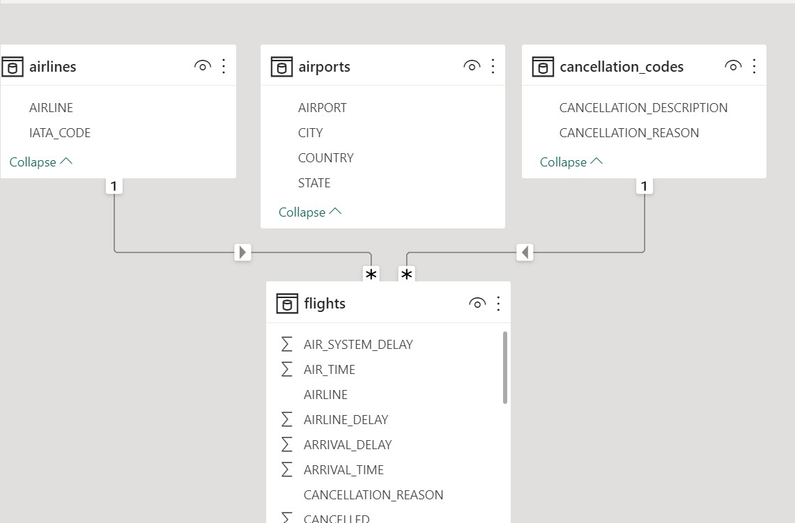

# Airline-Flight-Analysis-Exploring-Delay-and-Diversion-Trends

This project aims to analyze airline flight data to gain insights into delay and diversion trends among major airlines. Using publicly available data on flight delays and diversions, we explore patterns and trends across various airlines and airports to better understand the factors contributing to flight disruptions.

The analysis includes identifying the average delay time of aircraft by airline, the number of flights operated by each airline, the total number of diverted flights, the total number of delayed flights, and the reasons for flight delays. By examining these key metrics, we aim to provide a comprehensive overview of the performance of major airlines in terms of flight delays and diversions.

Our analysis will utilize various statistical and data visualization techniques to effectively communicate our findings. We will also provide insights into potential areas for improvement in airline operations and management to minimize the impact of flight disruptions on passengers and improve overall customer experience.

This project will be conducted using Power Bi and made publicly available on Github to facilitate collaboration and further research in the field of airline flight data analysis.

## Getting Started
To get started with this project, you can download the Power BI report file from the report directory. The report file is in .pbix format and can be opened using Power BI Desktop.

## Data
The data used for this analysis was supplied by Quantum Analytics where I am currently doing my internship as a data analyst. The data is stored in the data directory in CSV format, the data contains 4 tables.

## Running the Analysis
In order for the analysis to be done and for actual results to be given some steps had to be taken such as Data Cleaning, Data Modelling etc was carried out.
### Data Cleaning
The data was preprocessed using power query that is found in Power Bi before it was loaded for the analysisi proper. 
The processing include some cleaning such as
- Replacing of some incorrectly spelt word
- Promoting the first column of a table to header
- Deleting of bogus columns etc
### Data Modelling
The data contained 4 tables so there was need for modelling to be done. The four tables are
- Airline
- Airports
- Cancellation Codes
- Flights
To model it I used the start schema where i connected the first 3 tables to the last table in a one to many cardinality

## Results
The results of the analysis are presented in the form of charts and graphs, which can be found in the Power BI report. The report provides insights into delay and diversion trends among major airlines, including the average delay time of aircraft by airline, the number of flights operated by each airline, the total number of diverted flights, the total number of delayed flights, and the reasons for flight delays. The report also includes interactive visualizations that allow users to explore the data in more detail and identify specific patterns and trends.
### Reason For Cancellation

### Observation
From the Visualisation above you'll find out that weather was the major reason why flights were cancelled foolowed by Airline which made up about 28% of the reason for general flight cancellations.

### Total Flights By Airline

### Observation
The chart has made us to know that Southwest airline carried out the most flights hence it is safe to say that it is passengers favorite.

### Dashboard Proper
Other results can be found on this dashboard below

### Observation
A brief look at the dashboard will tell you that there was a total of 6 million flights within the said time frame and the average delay was 32.4 mins.
The total distance travelled was 5bn Kilometers

## Recommendation
From the above analysis here are my recommendations to Passengers
- Since weather is the major contributing factor to cancelled flights I recommend that passengers check the weather forecast before booking a flight.
- September has the most amount of delayed flights so passengers who wants to avoid delay should make sure not to plan their travels during that month.
- Haiwan Airline Inc. are the best airline when it comes to delay so passengers should consider booking their flights with them.

## Conclusion
Since weather is a major contributor to flight cancellation airline owners should plan their schedule with weather in mind. Airlines like Frontier airlines should improve their services by reducing the delay depature of their airline since their average delay is way above the average delay. Other airlines should look at Southwest airlines and emulate what they do that makes them amarse such amount of flights.

## Contributing
If you would like to contribute to this project, please feel free to fork the repository and submit a pull request. Your contributions are greatly appreciated!

